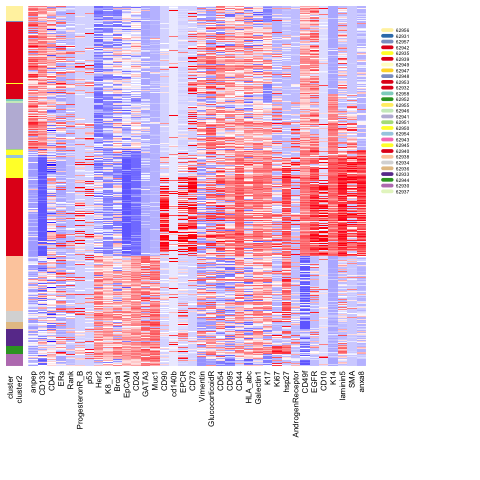
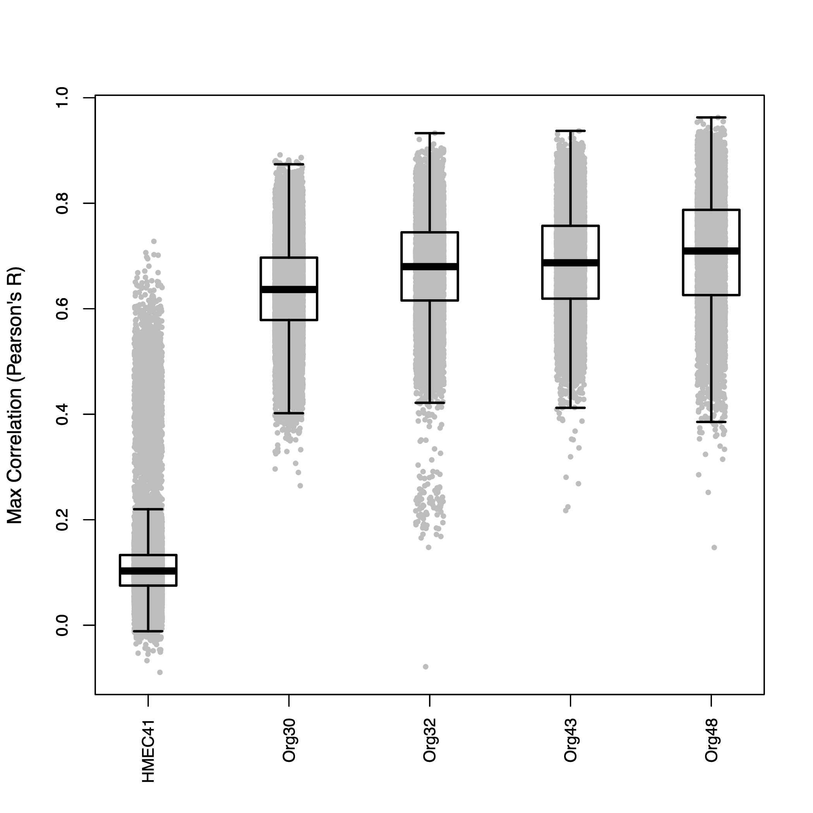
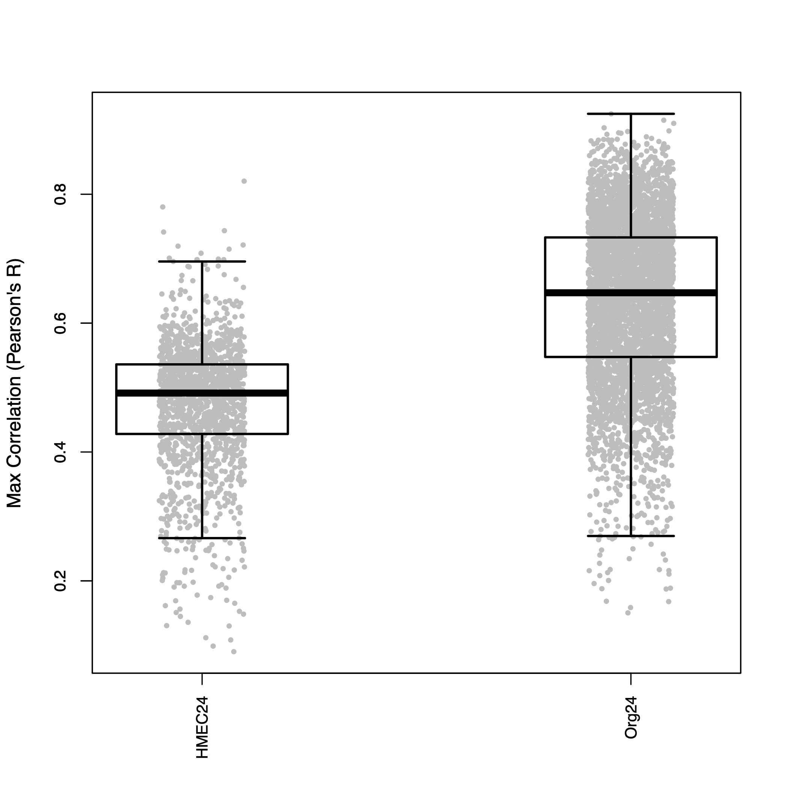
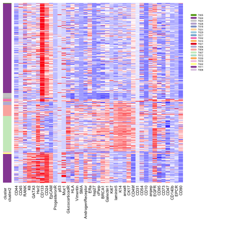
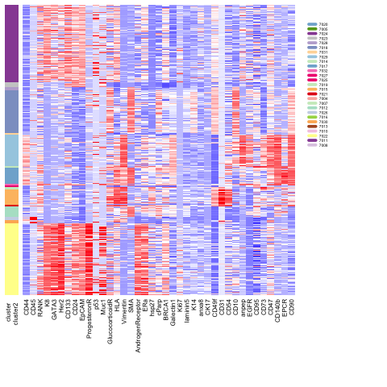
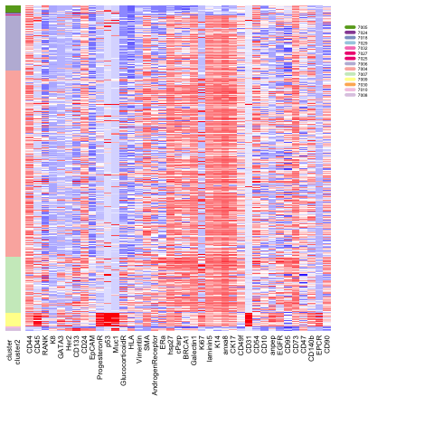
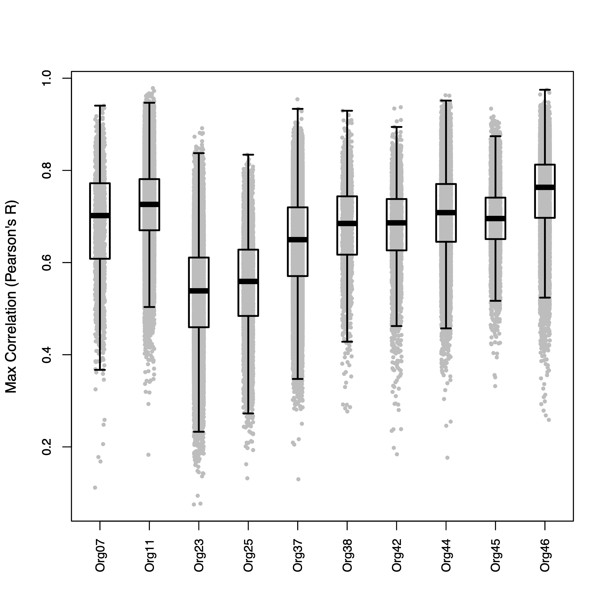
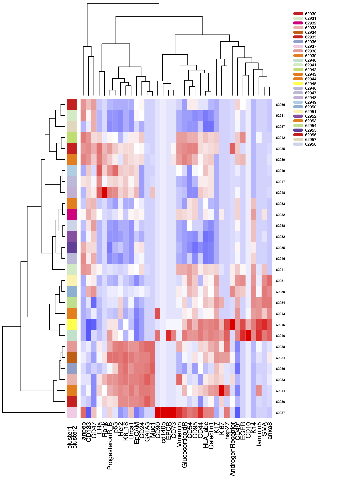

# Rosenbluth_organoid_cultures_NatureComm2020
 Code for "Organoid Cultures from Normal and Cancer-Prone Human Breast Tissues Preserve Complex Epithelial Lineages",
 published in Nature Communications, 2020.
 
# Description of scripts
## figure_3d.r 	
	
R code to generate heatmap depicted in Figure 3d.

The script reads in a .csv file from Xshift (csv_ID2096_heatmap_ORGANOIDS_Run1.csv) which can be downloaded from from [https://flowrepository.org/id/FR-FCM-Z2HY].
It normalizes, clusters, and creates a .pdf and a .png file of the Figure 3d heatmap:

Figure 3d. Mass cytometry assessment of mammary cell subtypes in normal breast organoids. Heat map showing the expression levels of the indicated markers in the cells from a representative organoid culture.  The 38 markers in the CyTOF panel are shown on the x-axis, and individual cells on the y-axis are ordered based on X-shift clustering.  

## figure_4e_5b.r   
	
R code to generate boxplots in figures 4e and 5b. 
The script reads in XShift .csv files from 3 independent CyTOF runs for organoids
with matched primary tissue:
	
Heatmap_ID1892_HMEC41_WT29.csv  
20190619_HOP_HMEC24_ORG24.csv  
Heatmap_ID1922_AllTheRest.csv  

These files can be downloaded from [https://flowrepository.org/id/FR-FCM-Z2H2]). 
Generates expression signatures for each major epithelial 
cluster by calculating the median value for each cyTOF marker within each cluster from each primary tissue
sample. Pearson's R coefficients for each organoid-derived cell compared to matched primary tissue signatures
are calculated and the max Pearson's R for each cell is written to a file to generate boxplots.  

Complex mammary-specific protein expression patterns from the tissue of origin are maintained in culture.  Four normal mammary tissues were digested to single cells and fixed with paraformaldehyde.  In parallel, organoid cultures were generated from each of the tissues, passaged four times, digested to single cells, and fixed.  Protein expression levels of 38 markers associated with mammary tumorigenesis and development were analyzed at the single cell level in the organoid cultures and the matched tissues of origin using cytometry by time of flight (CyTOF).  
Correlation between the protein expression profiles of each HMEC or organoid cell and expression signatures derived from the major epithelial clusters in matched primary tissue. Box plots show the maximum Pearson’s r for each cell, stratified by sample.  

Figure 5b  
  
Mammary tissue was dissociated and used to generate an organoid culture (ORG24) as well as a standard two-dimensional HMEC culture (HMEC24).  Cells from the tissue was also directly fixed and frozen for future analysis.  Cells from the cultures in conjunction with cells from the tissue were analyzed by CyTOF. Correlation between the protein expression profiles of HMEC or organoid cell and expression signatures derived from the major epithelial clusters in matched primary tissue.  
	
## figure_5a.r  	
R code to generate heatmaps in Figure 5a.
The script reads in a .csv file from Xshift which can be downloaded 
from [https://flowrepository.org/id/FR-FCM-Z2H2]:  

Heatmap_ID1892_HMEC41_WT29.csv  

Normalizes, clusters and creates .pdf file of the heatmap in Figure 5a.

Mammary tissue was dissociated and used to generate an organoid culture (ORG24) as well as a standard two-dimensional HMEC culture (HMEC24).  Cells from the tissue was also directly fixed and frozen for future analysis.  Cells from the cultures in conjunction with cells from the tissue were analyzed by CyTOF.  Heat maps show single cells from the cultures or matched tissue as indicated, with color bar on left indicating different X-shift defined clusters.  

Organoid Culture  

  

Breast Tissue of Origin  

  

HMEC Culture  

  
			
## figure_5c.r 	
R code to generate boxplots in figure 5c.
The script reads in four Xshift.csv files which are available at [https://flowrepository.org/id/FR-FCM-Z2H2] and [https://flowrepository.org/id/FR-FCM-Z2HY] (csv_ID2096_heatmap_ORGANOIDS_Run1.csv,Org23 Org25 for Laura_ORGANOIDS_Run2.csv, Heatmap_ID1922_AllTheRest.csv, 20190619_HOP_HMEC24_ORG24.csv). These organoid samples do not have matched primary tissue, so expression signatures for each major epithelial cluster are defined as the median value for each cyTOF marker within each cluster across a set of four non-matching primary tissue samples. CyTOF data from 10 unmatched organoid epithelial samples are correlated to these signatures. The max Pearson's R for each cell is written to a file to generate boxplots.
 
Figure 5c
  

Correlation analysis performed for the indicated ten organoid cultures as compared to a set of four non-matching primary breast tissues.
	
## figure_S4.r 	
R code to generate heatmap in supplemental figure S4.
The script reads in a .csv file from Xshift which can be downloaded from
from [https://flowrepository.org/id/FR-FCM-Z2H2]:  

csv_ID2096_heatmap_ORGANOIDS_Run1.csv  

Normalizes, clusters and creates .pdf file of the heatmap in supplemental Figure S4.

Supplementary Figure 4.
  

Heat map of X-shift-defined clusters from 12 organoid cultures analyzed by CyTOF. CyTOF analysis was performed on 12 organoid cultures derived from normal human mammary tissues. Clustering of cells was performed using X-shift to define 29 distinct clusters (y-axis). The heat map displays the median abundance of each of the markers in the panel (x-axis).	
 	
 
	

 
 
